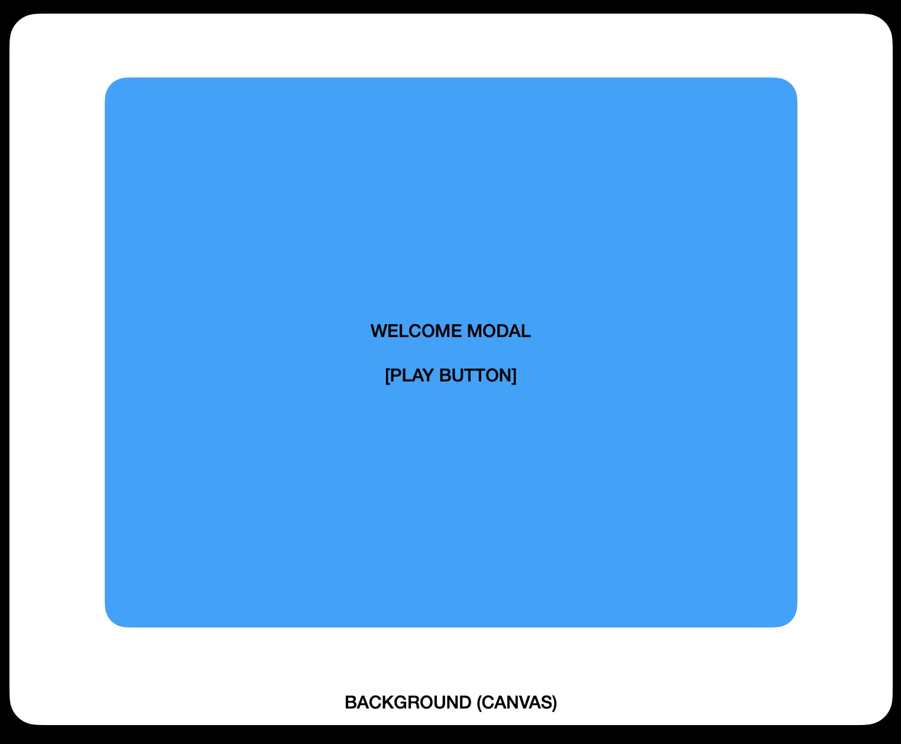
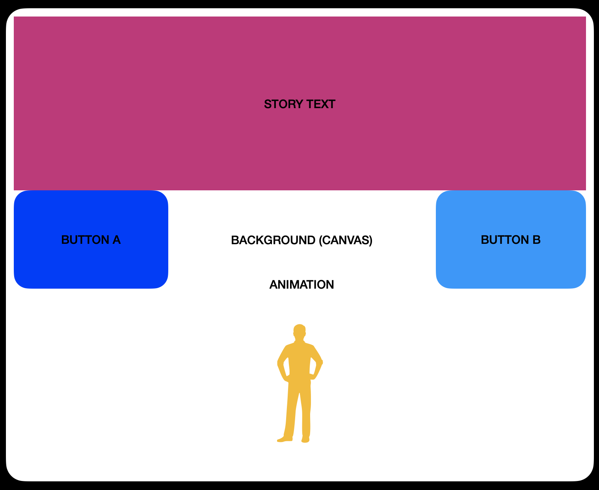
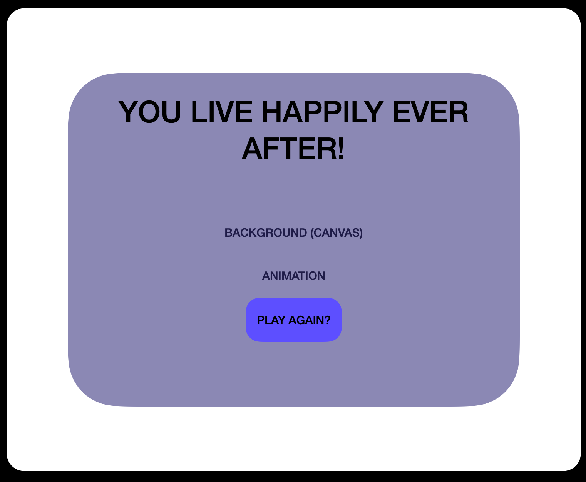
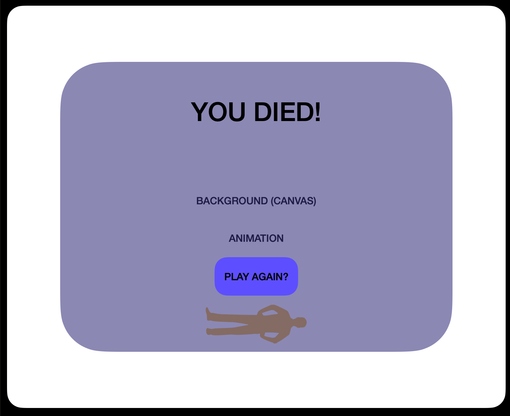

# Choose Your Own Adventure

## User Story:

1. The user brings up the home/main page and they see a
   prompt (modal) asking them to play.

2. The user clicks play (it's their only option).

3. The user now sees the modal disappear- and behind it is a landscape with an animated
   character. Above the character there is text telling a story.

4. The user now reads the text and chooses between 2 options below (2 buttons).

5. The user's choice now brings them down a path, creating their own story line. Each story line eventually ends. You can win or loose. Each bend in the path (each button) brings the user to a
   new page, or new animation.

   A. If the user makes about 3 button clicks and it leads to death- a modal will
   appear saying they died (sad).

   B. If the user chooses around 3 button clicks and it leads to a "happily ever
   after" a modal will pop up congratulating them on their win!

6. If the user gets either outcome, the modal will still contain a "play again?" button, that
   resets the game and they start fresh.

##Wire Frames:

