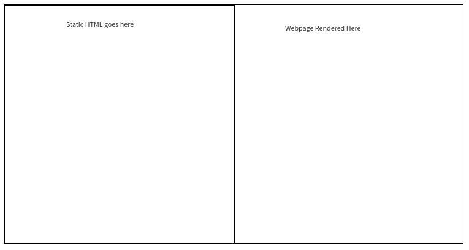

What is the project?

# Portfolio.dev

Instead of paying $10-$20 per year to host your dev portfolio(which you likely will take down at some point), host it for free on portfolio.dev. Host it permanently

We store your static html and css and then serve it up to a customized url

Proof of concept, to be delivered on Monday: Prove that static, vanilla HTML can be entered by a user, stored in the DB persistently, and served up to another user on the web. 

(UI may be similar to Codepen except OUTPUT is displayed instead of CODE)

User stories:

* User inputs static HTML and CSS.
* They click a button, wait a few seconds, and see the result render on the webpage.
* User should be able to style up a MULTI-PAGE website with customiable links
	* If this proves difficult, the user should be able to at least fill in a pre-populated set of links
* Great project = customizability
* Good project = FREE functionality for end user to build dev portfolio (MVP)

