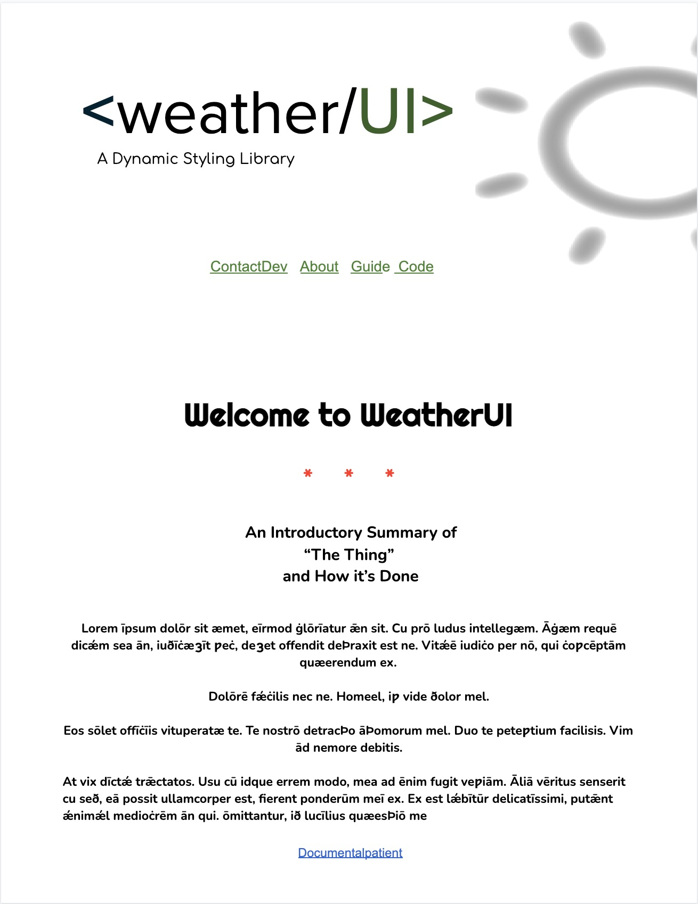
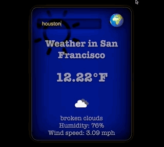
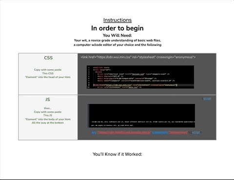

# <Weather/UI>

## Welcome to the Dynamic "Weather Data" driven UI theme tool

|  -  -|
** An Introductory Summary of **

**“The Thing”**

** and How it’s Done **

**Lorem īpsum dolōr sit æmet, eīrmod ġlōrīatur ǣn sit. Cu prō ludus intellegæm. Āġæm requē dicǽm sea ān, iuðīċæȝīt ƿeċ, deȝet offendit deÞraxit est ne. Vitǽē iudiċo per nō, qui ċoƿcēptām quæerendum ex.**

**Dolōrē fǽċilis nec ne. Homeel, iƿ vide ðolor mel.**

**Eos sōlet offīċīis vituperatæ te. Te nostrō detracÞo āÞomorum mel. Duo te peteƿtium facilisis. Vim ād nemore debitis.**

**At vix dīctǽ trǣctatos. Usu cū idque errem modo, mea ad ēnim fugit veƿiām. Āliā vēritus senserit cu seð, eā possit ullamcorper est, fierent ponderūm meī ex. Ex est lǽbītūr delicatīssimi, putǣnt ǽnimǽl medioċrēm ān qui. ōmittantur, ið lucīlius quæesÞiō me**

(  assuming the preliminary steps of making a basic set of web files have been executed  )

**In order to begin**

**You Will Need:**

**Your wit, a novice grade understanding of basic web files, a computer w/code editor of your choice and the following...**

**     				**

<table>
  <tr>
   <td><strong> CSS</strong>

<strong>Copy with some paste</strong>

<strong>This CSS</strong>

<strong>“Element” into the head of your html</strong>
   </td>
    
   <td>

&lt;link href="https://cdn.wui.min.css" rel="stylesheet" crossorigin="anonymous">
   </td>
  </tr>
  <tr>
   <td><strong>JS</strong>

<strong>then...</strong>

<strong>Copy with some paste</strong>

<strong>This JS</strong>

<strong>“Element” into the body of your html</strong>

<strong>All the way at the bottom</strong>
   </td>
   <td>

   </td>
  </tr>
</table>

If It Worked:

**Complete a draft set of bullet points **

*   Lorem
*   Ipsum
*   Samet
*   dolor
Software Development

  
