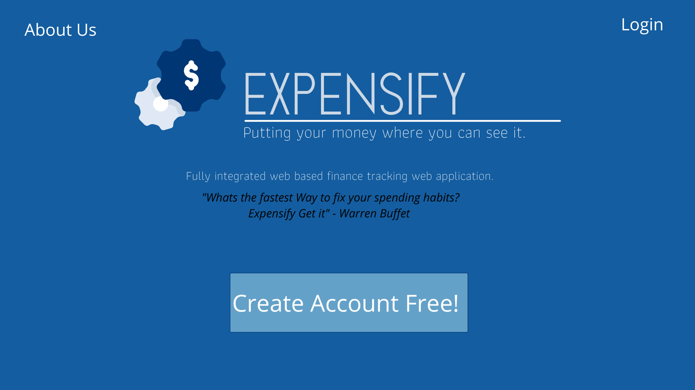
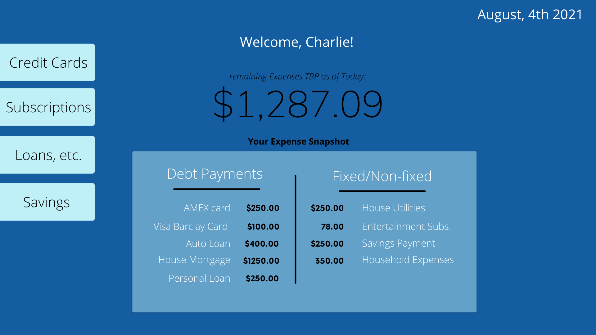
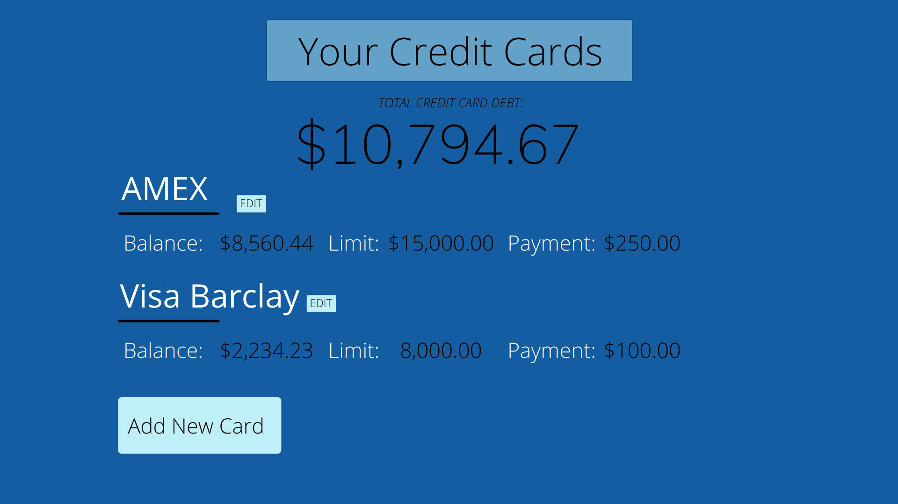

# Project 4 - Expensify

## Synopsis: 

Keeping track of finances can be challenging and confusing.  Spreadsheets can be tedious to use as well as difficult for the average user.  That is where Expensify comes in, to help organize your monthly expenses to get a better idea of what your spending habits are to make smarter, more informed purchase decisions. 

## User Stories 

- Initial users be able to create an account with Expensify to be able to add my personal expenses. 

- Upon logging in, a user will see a dashboard page that displays any upcoming expenses that are to be paid or will be automatically debited from their bank account.  As well as any recent monthly expenses that have already occured from the beggining of the month until that moment.  

    - further more there will be a dollar amount at the top that will represent the total amount to be billed left in the month. (Remaining required cash to pay) 

    - Also on this dashboard page it will have a breakdown of all the categorized expenses

- The user also will be able to navigate to various pages that categorize different types of expenses. 

    Such as:  

    - Credit Cards (that will have a principal balance as well as a payment amount for each one.)  Along with totals at the top of the page that represent a total amount of credit card debt, and total monthly payments being made toward them. 

    - Bank Loans:  This includes auto loans, personal loans and even mortgages, similarly set up to the credit card page.

    - Subscriptions & Monthly dues:  This includes cell phone bills, cable/internet bills, Neflix or other entertainment expenses, etc.   This will also have a running tally total shown at the top.

    - Non-fixed expenses:  This will show any expenses the user has added in that are estimates based on their lifestyle and habits.  Such as gas, groceries, clothes, leisure spending, etc. 

    - Savings deposits:  This will represent any money intentionally set aside to be desposited into a savings account/other account to not be spent.  

- The user will be able to edit, delete or modify all of the dollar amount, due dates or entire bill at any one of these page locations.  

 
## Wire Frames:

### Home Page
#### This will be the home page of the site, where new users can sign up or existing users can login to thier account. 

### Main Dashboard Page
#### Here the user will see basic information regard their expenses as well as some snapshots of more detailed info. On the left there is a navbar that can take the user to more detailed information regarding their specific expenses. 

### Credit Card Page (example)
#### Here is an example of a more detailed account page where a user can interact with their expense categories by either viewing, editing, deleting or adding more expense accounts. By adding to these accounts it will reflect what is displayed on the dashboard page. 

